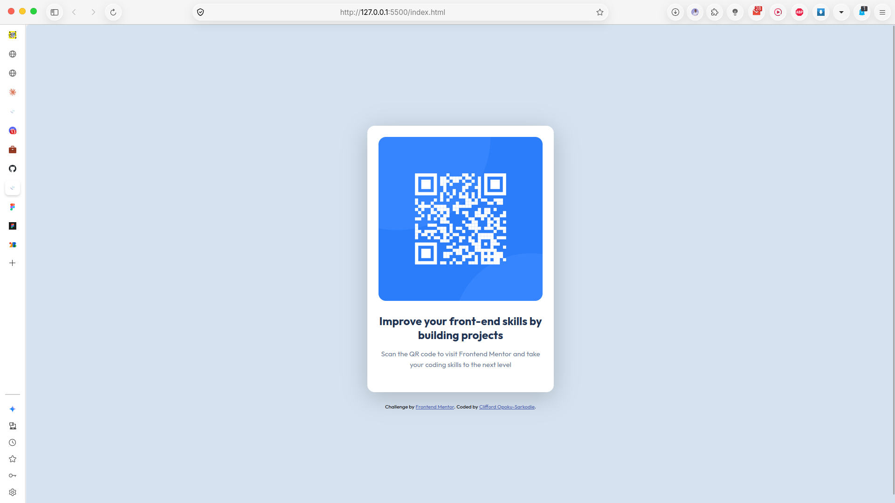

# Frontend Mentor - QR code component solution

This is a solution to the [QR code component challenge on Frontend Mentor](https://www.frontendmentor.io/challenges/qr-code-component-iux_sIO_H). Frontend Mentor challenges help you improve your coding skills by building realistic projects. 

## Table of contents

- [Overview](#overview)
  - [Screenshot](#screenshot)
  - [Links](#links)
- [My process](#my-process)
  - [Built with](#built-with)
  - [What I learned](#what-i-learned)
  - [Continued development](#continued-development)
  - [Useful resources](#useful-resources)
  - [AI Collaboration](#ai-collaboration)
- [Author](#author)
- [Acknowledgments](#acknowledgments)

## Overview

This project is my solution to the Frontend Mentor QR code component challenge. I built a responsive QR code card using semantic HTML and CSS.

The component includes a QR code image, a heading, and supporting text. I used Flexbox to center the card on the page and Google Fonts to apply the Outfit typeface.

### Screenshot



### Links

- Solution URL: [Frontend Mentor solution](https://t.co/dthlZHykmw)
- Live Site URL: [View the live site](https://cliff-de-tech.github.io/qr-code-component-main/)

## My process

### Built with

- Semantic HTML5 markup
- CSS custom properties
- Flexbox
- Google Fonts

### What I learned

I was able to learn:

- The structuring of the page using semantic HTML
- Using Flexbox to center and stack elements
- Importing and applying the Outfit font
- Matching colors from the style guide
- Using BEM-style class names such as ```card__title```

### Continued development

I want to improve on

- Responsive layouts
- More CSS positioning techniques
- Accessibility and better image descriptionns


### Useful resources

- [Frontend Mentor](https://www.frontendmentor.io/) - Provided the challenge and design specifications.
- [Google Fonts](https://fonts.google.com/specimen/Outfit) - Used to import the Outfit font.
- [MDN CSS Flexbox](https://developer.mozilla.org/en-US/docs/Web/CSS/CSS_flexible_box_layout) - Helped me understand how to center and stack the page elements.
- [MDN HTML elements](https://developer.mozilla.org/en-US/docs/Web/HTML/Reference/Elements) - Helped me choose appropriate semantic HTML elements.

### AI Collaboration

I used GitHub Copilot to receive guidance about:

- HTML structure
- CSS layout and flexbox
- Debugging the footer position
- Understanding README sections and how to fornat them

## Author

- Website - [Clifford Opoku-Sarkodie](https://cliffdetech.dev)
- Frontend Mentor - [@cliff-de-tech](https://www.frontendmentor.io/profile/cliff-de-tech)
- Twitter - [@cliffdetech](https://www.twitter.com/cliffdetech)
- LinkedIn - [Clifford Opoku-Sarkodie](https://www.linkedin.com/in/clifford-opoku-sarkodie/)

## Acknowledgments

Thanks to Frontend Mentor for providing this challenge and design resources.

I also used GitHub Copilot as a learning assistant to help me understand semantic HTML, CSS Flexbox, responsive layout, and README formatting.
